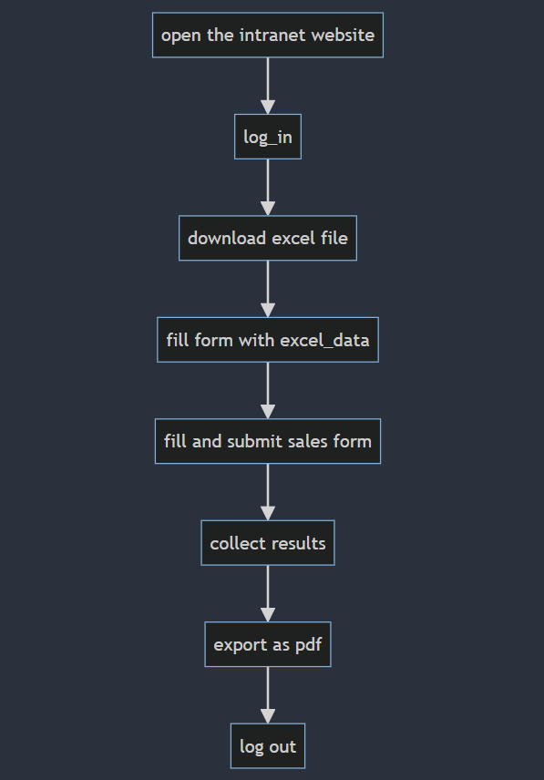
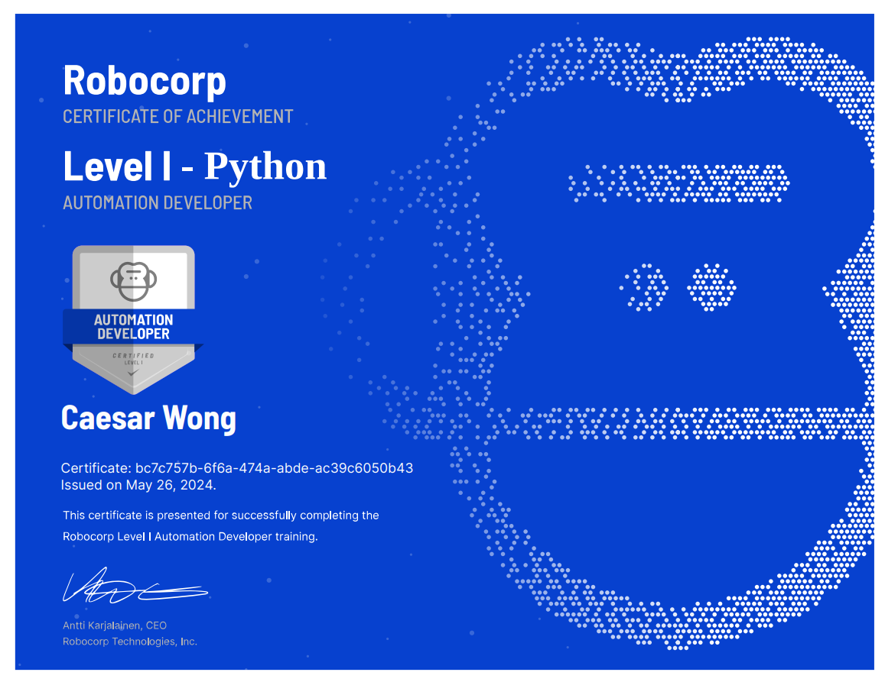

# Sales Data Automation Bot

## Overview

This repository contains the `SalesDataAutomationBot`, which automates the process of downloading sales data, updating the intranet, and generating a weekly report.

## Features

- **Login**: Automates the login process to the intranet.
- **Download Sales Data**: Downloads the weekly sales data from the RobotSpareBin online sales application.
- **Update Intranet**: Enters the sales data for each representative into the intranet.
- **Generate Report**: Takes a screenshot of the updated intranet page and converts it to a PDF for the weekly newsletter.

## Flowchart

The following flowchart illustrates the process automated by the bot:



## Running the Bot

Follow these steps to set up and run the bot:

1. **Install Conda Environment**

   First, create the Conda environment using the provided `conda.yaml` file:

   ```bash
   conda env create --file conda.yaml
   ```

2. **Activate the Environment**

    After creating the environment, activate it:

    ```bash
    conda activate robocorp_env
    ```

3. **Run the Bot**

    Finally, run the bot using the following command:
    ```bash
    python -m robocorp.tasks run tasks.py
    ```

### Results

🚀 After running the bot, check out the `log.html` under the `output` -folder.

## Dependencies

We strongly recommend getting familiar with adding your dependencies in [conda.yaml](conda.yaml) to control your Python dependencies and the whole Python environment for your automation.

## Acknowledgements

This bot was built as part of completing the [Robocorp Automation Developer Certificate Level 1 - Python](https://robocorp.com/docs/courses/beginners-course-python).

Certificate:


